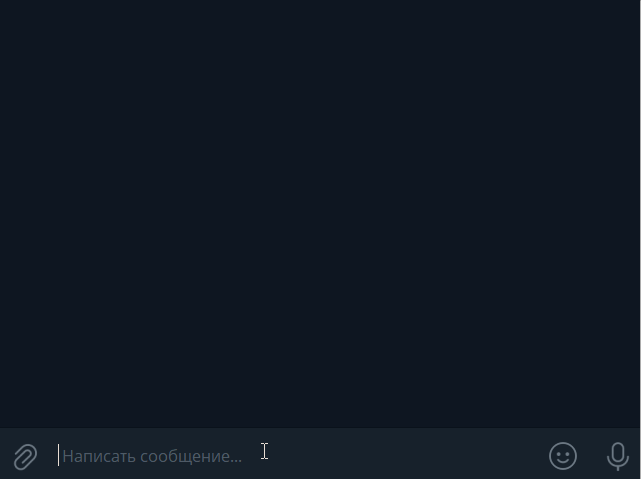
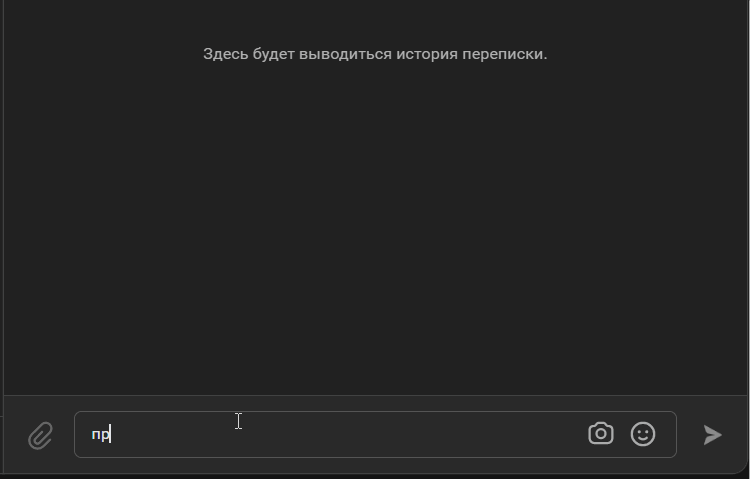

# SmartBot

Боты предназначены для облегчения работы службы поддержки с клиентами. 
Их можно обучить отвечать на очень частые вопросы, на которые уже есть готовые решения.
Для обучения ботов используется сервис [DailogLow](https://habr.com/ru/articles/502688/)

#### Пример работы бота в телеграм:


#### Пример работы бота VK:


#### Требования перед установкой:
1. Создайте проект в [DialogFlow](https://dialogflow.cloud.google.com/#/getStarted) - вы получите идентификатор проекта вида: _moonlit-dynamo-211973_
2. Создайте агента [GoogleCloud](https://cloud.google.com/dialogflow/es/docs/quick/build-agent)
3. Включите GoogleAPI DialogFlow и получите файл с ключами credentials.json
4. Создайте бота в телеграм - напишите отцу ботов [@BotFather](https://t.me/BotFather)
5. Аналогично создайте еще одного бота - он будет высылать вам отчеты об ошибках
6. Получите ID своего чата - в него будут приходить сообщения об ошибках [@userinfobot](https://t.me/userinfobot)
7. Создайте сообщество в [VK](https://vk.com/groups?tab=admin)
8. Получите токен на кладке _Управление -> Работа с API_
9. Должен быть установлен интерпретатор Python версии 3.9 или выше
10. Подготовьте и создайте файл с обучающими фразами (вопросами и ответами для DialogFlow) - файл может быть на сервере или в папке проекта. Файл должен иметь следующую структуру:

```json
{
  "Устройство на работу": {
    "questions": [
      "Как устроиться к вам на работу?",
      "Как устроиться к вам?",
      "Как работать у вас?",
      "Хочу работать у вас",
      "Возможно-ли устроиться к вам?",
      "Можно-ли мне поработать у вас?",
      "Хочу работать редактором у вас"
    ],
    "answer": "Если вы хотите устроиться к нам, напишите на почту game-of-verbs@gmail.com мини-эссе о себе и прикрепите ваше портфолио."
  },
  "Забыл пароль": {
    "questions": [
      "Не помню пароль",
      "Не могу войти",
      "Проблемы со входом",
      "Забыл пароль",
      "Забыл логин",
      "Восстановить пароль",
      "Как восстановить пароль",
      "Неправильный логин или пароль",
      "Ошибка входа",
      "Не могу войти в аккаунт"
    ],
    "answer": "Если вы не можете войти на сайт, воспользуйтесь кнопкой «Забыли пароль?» под формой входа. Вам на почту прийдёт письмо с дальнейшими инструкциями. Проверьте папку «Спам», иногда письма попадают в неё."
  }
}
```

#### Установка и запуск:
Скопируйте файлы из репозитория в папку

В корне проекта создайте файл _.env_ со следующим содержимым:

```python
TG_BOT_TOKEN=<Токен вашего бота в телеграм>
GOOGLE_APPLICATION_CREDENTIALS=<путь к файлу credentials.json>
PROJECT_ID=<ID проекта полученный в DialogFlow>
QUESTIONS_URL=<Путь к файлу JSON с обучающими фразами>
LOGGER_BOT_TOKEN=6221846115:<Токен вашего бота-логгера в телеграм>
ALLOWED_CHAT_ID=<ID вашего чата, в который будут прилодить сообщения от логера>
VK_TOKEN=<Токен вашего сообщества во ВКонакте>
```

Установите зависимости:

```python
pip install -r requirements.txt
```

Запуск всех ботов осуществляется командой:

```python
python bots.py
```